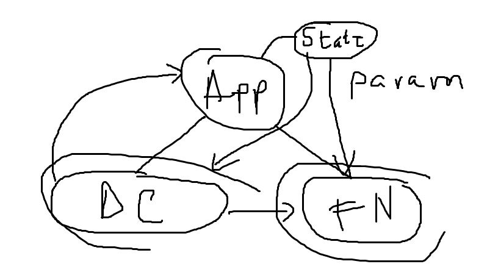

# Training React

Made by Andrei Mărunțiș

## Running the app

Just run `npm i` and `npm start` from root directory.

## Useful links

- JSX: https://reactjs.org/docs/introducing-jsx.html
- Conditional Rendering: https://reactjs.org/docs/conditional-rendering.html
- `useState`: https://reactjs.org/docs/hooks-state.html
- `useEffect`: https://reactjs.org/docs/hooks-effect.html
- Artistic explanation for Upcasting states:

